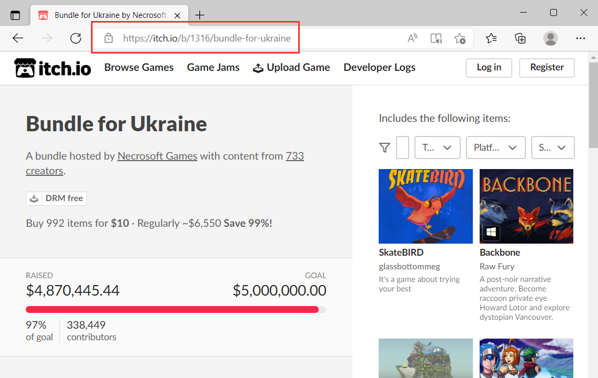
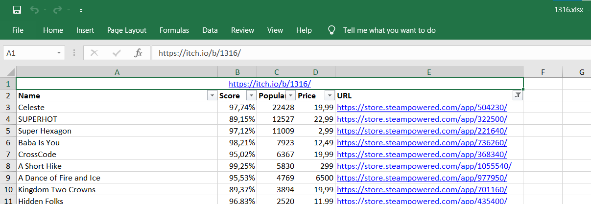

# Itch.io - Steam bundle information

## Description

The application collects Steam information for games in a given Itch.io bundle, and prints it to Excel.

Information printed:
* Itch.io bundle URL
* Name
* Score: Steam review score in percentage
* Popularity: Number of Steam reviews
* Price: Steam price in default currency
* URL: Steam URL

## Pre-requisites

* Python 3.9+. 
* Install requirements with `pip install -r requirements.txt`. 

## Usage

* Run with `py main.py`.
* Provide Itch.io bundle ID or URL when asked. 
  * Note: Only certain bundle types work. If given bundle is not accepted, the application will exit.
* Wait for the processing to finish.
* Open the generated Excel file located at `output/<bundle ID>.xlsx`.

## Example

## Notes

* APIs used:
  * Itch.io bundle information: `https://itch.io/bundle/<bundle ID>/games.json`
  * Steam application list: `https://api.steampowered.com/ISteamApps/GetAppList/v0002/?key=STEAMKEY&format=json`
  * Steam review information: `https://store.steampowered.com/appreviews/<app ID>?json=1`
  * Steam game information: `https://store.steampowered.com/api/appdetails?appids=<app ID>`

* Documentation:
  * Steam application list: https://partner.steamgames.com/doc/webapi/ISteamApps#GetAppList
  * Steam review information: https://partner.steamgames.com/doc/store/getreviews
  * XlsxWriter: https://xlsxwriter.readthedocs.io/

